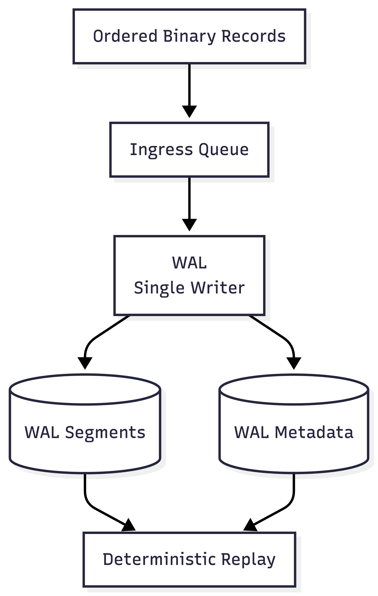
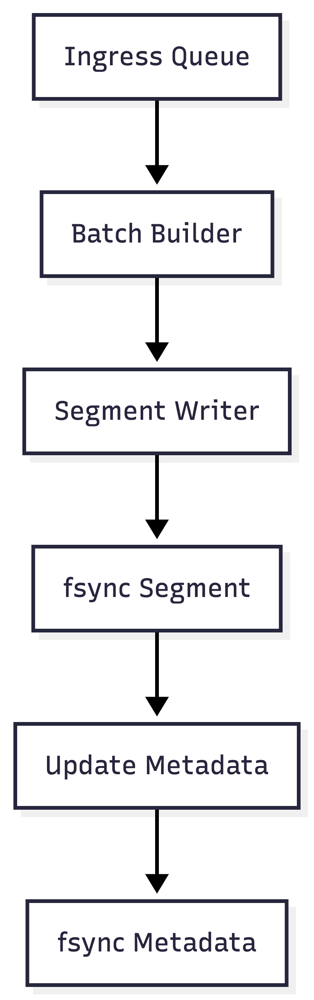
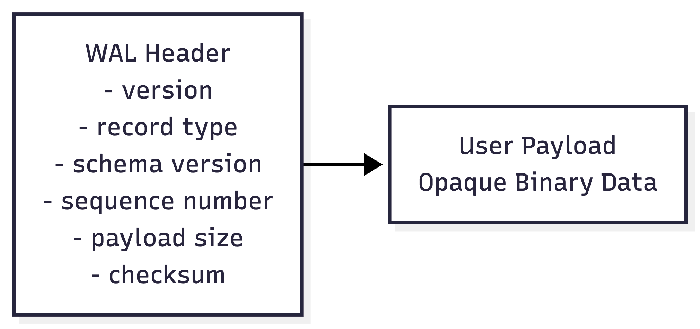
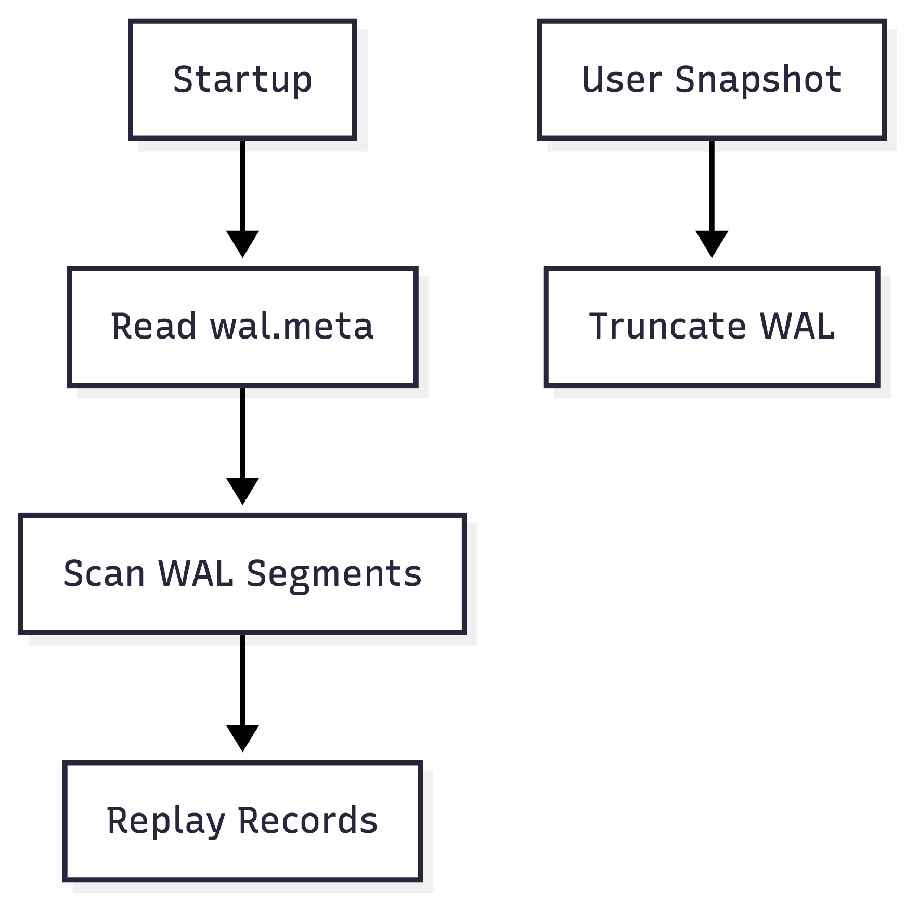

# WAL-CPP

WAL-CPP is a **single-writer, append-only Write-Ahead Log (WAL)** library designed
for **deterministic recovery, crash safety, and replay**.

It is intended to be used as a **foundational infrastructure component**
for systems such as:

- order matching engines
- trading systems
- event-sourced services
- stateful low-latency systems

WAL-CPP focuses strictly on **durability and ordering**, not business logic.

---

## Key Properties

- Single writer thread (no concurrent writes)
- Append-only log structure
- Total ordering via sequence numbers
- Batch-based writes with atomic commit semantics
- Crash-safe recovery using metadata
- User-defined payloads (opaque to WAL)
- Explicit, user-controlled truncation

---

## What WAL-CPP Is

- A durability and ordering layer
- A source of truth for events
- A deterministic replay mechanism

## What WAL-CPP Is NOT

- A database
- A serializer or schema manager
- A business logic engine
- A message broker

---

## High-Level Architecture

At a high level:

1. The user/engine serializes data into binary form
2. A sequencer assigns a monotonic sequence number
3. Records are submitted via a queue
4. A single WAL thread persists records to disk and metadata
5. Replay is performed by user logic using WAL-provided iteration

---

## WAL Internal Pipeline

The WAL thread performs the following steps:

1. Drain ingress queue
2. Build batches
3. Append records to the active segment
4. fsync segment file
5. Update metadata
6. fsync metadata

A batch is considered **committed only after metadata is fsynced**.

---

## WAL Record Layout

Each WAL record consists of:

- A WAL-owned header (sequence number, sizes, checksums, versions)
- A user-defined opaque binary payload

The WAL **never interprets or deserializes** the payload.

---

## Recovery and Truncation

- WAL is able to recover itself without user logic
- Replay start position and filtering are user-controlled
- WAL never deletes data unless explicitly instructed via a safe sequence

---

## Design Documentation

Detailed design documentation is available here:  
[docs/design.md](docs/design.md)

---

## Design Invariants

The following invariants are non-negotiable:

- WAL has exactly one writer thread
- WAL records are totally ordered by sequence number
- Sequence numbers are WAL-owned, not user-defined
- User payloads are opaque to WAL
- WAL never truncates data without an explicit safe sequence
- Recovery is deterministic and repeatable

---

## Status

This repository is currently **design-first**.
Public APIs and implementation will follow after the design is fully locked.
